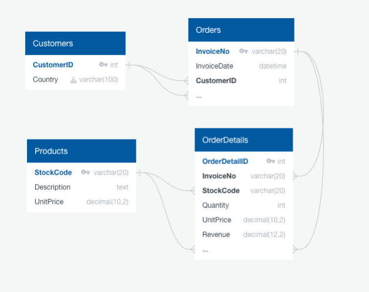
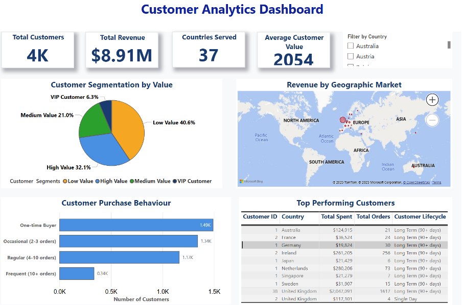

# Customer-Behavior-Analytics-Retail-Data-Analysis

## 🎯 Project Background
An online retailer operating in 37+ countries with 540,000+ transactions aims to strengthen customer relationships and refine targeted marketing strategies. Leveraging transaction data on sales, customer behavior, geography, and product preferences, this project delivers data-driven insights to identify high-value customers and maximize lifetime value through segmentation.
This project demonstrates **end-to-end analytics**: transforming raw Excel data into a structured MySQL database, applying data quality management in R, and building executive-ready Business Intelligence dashboards in Power BI.

 Key Insights
•	**Customer Value & Segmentation**: Identified VIP customers and high-value segments, enabling precision-targeted campaigns and lifetime value optimization.

•	**Geographic Intelligence & Loyalty**: Analyzed purchase frequency, timing, and regional trends across 37+ countries to inform expansion and resource allocation.

This equips leadership to shift from broad-market tactics to customer-centric strategies, driving targeted marketing, efficient acquisition, and sustainable growth.

## 🗃️ Data Structure 
Customer Analytics Database as seen below consists of four normalized relational tables: Customers, Products, Orders, and OrderDetails, with a total of 541,909 original records spanning comprehensive retail transaction data. Following advanced data quality engineering and ETL optimization, the production database contains 397,884 clean records (73.4% retention rate), demonstrating rigorous data governance standards and professional data pipeline management.

  

## 💼 Executive Summary

### Overview of Findings
Customer analytics highlight major opportunities for targeted marketing and customer relationship optimization within a strong global retail operation. With 4,338 active customers across 37 markets generating **$8.91M annual revenue**, the business shows both scale and depth. Notably, **6.3% of customers (275 VIPs)** contribute **53.9% of revenue ($4.8M)**—a clear case for precision-targeted marketing and lifetime value optimization.
Key metrics reinforce strong performance: average customer value $2,054 and a 65.6% repeat rate, reflecting brand loyalty and scalability of customer-centric strategies.

The analysis reveals **four critical customer value segments** with exceptional profitability metrics that significantly exceed industry benchmarks:

1.	**VIP Customers** – 275 customers, $17,461 average value, 53.9% revenue contribution
2.	**High Value** – 1,393 customers, $2,155 average value, 33.7% revenue contribution
3.	**Medium Value** – 909 customers, $715 average value, 7.3% revenue contribution
4.	**Low Value** - 1761 customers, $260 average value, 5.1% revenue contribution
   
Together, VIP and High-Value segments form just **38.6% of the base but generate 87.6% of revenue ($7.8M)**, offering compelling ROI for premium marketing and personalized experience strategies. Geographic insights reveal concentrated high-value clusters across 37+ countries, guiding **international expansion and market penetration strategies**. 

The accompanying dashboard visualizes customer value distribution, geographic performance, and behavioral segmentation to support data-driven growth decisions.

  

## 📊 Customer Value & Segmentation Intelligence
Analysis reveals an exceptionally concentrated value structure with major opportunities for precision-targeted marketing. The VIP tier is led by the top 20 customers averaging $134K+ lifetime value (some exceeding $280K) across markets like the Netherlands, UK, and Ireland. These ultra-high-value customers show long-term loyalty, purchasing 700+ unique products over multiple years, validating premium positioning.

Behavioral segmentation analysis reveals four distinct customer archetypes with dramatically different value propositions and engagement patterns:

• **Frequent Customers (10+ orders)** – 337 customers (7.8%) generating $13,029 average value with exceptional $48.74 transaction values and 21.1 orders per customer, representing the highest-engagement, premium customer segment ideal for VIP loyalty programs and exclusive product launches.

• **Regular Customers (4-10 orders)** – 1,165 customers (26.9%) delivering $2,156 average value with solid $26.64 transactions and 6 orders each, forming the core customer base perfect for retention campaigns and cross-selling strategies.

• **Occasional Buyers (2-3 orders)** – 1,343 customers (31.0%) contributing $1,037 average value with $86.32 transactions and 2-3 orders, representing high-potential conversion targets for engagement campaigns and repeat purchase incentives.

• **One-time Buyers** – 1,493 customers (34.4%) spending $413 average with $89.16 single transactions, indicating significant reactivation opportunities through targeted win-back campaigns and personalized remarketing.

Value concentration is striking: Frequent customers deliver 32x the value of one-timers ($13K vs $413). Together, frequent and regular customers (34.7% of the base) likely generate 70%+ of total revenue, underscoring the ROI of premium investment and high-touch relationship strategies.

 
## 🌍 Geographic Intelligence & Loyalty Analysis

Analysis across 37+ markets reveals regional value clusters and loyalty patterns guiding expansion and resource allocation. **Nordic markets** lead in premium performance: Norway delivers **$3,616 per customer with 30% VIP concentration**, while Finland shows 50% high-value penetration—both ideal for premium positioning and high-margin strategies.

Three geographic tiers emerge:

• **Premium Markets** – Norway, Switzerland, Netherlands delivering $2,800+ average customer value with 30%+ VIP customer rates and exceptional customer lifetime metrics (115+ days average), representing mature markets ideal for premium product launches and luxury positioning strategies.

• **Core European Markets** – Germany, France, United Kingdom generating $2,200-2,400 average customer value with balanced customer portfolios and strong repeat customer rates (92%+ long-term customers in Germany), forming the revenue backbone perfect for market share expansion and customer base scaling.

• **Emerging Opportunity Markets** – Belgium, Spain, Italy showing $1,250-2,150 customer values with developing loyalty patterns and growth potential, representing strategic expansion targets for market penetration and customer acquisition investments.

Customer loyalty is strongest in Nordics with **0% churn and 100% long-term retention**, while the UK provides scale leadership (3,920 customers, $7.3M revenue, 200+ day lifecycle), supporting subscription models and lifecycle-based campaigns. The Netherlands combines $5,698 per customer with 100% retention, exemplifying high-concentration premium market potential, while the UK offers volume-driven growth—together enabling differentiated strategies across premium vs. scale markets.

## 💡 Recommendations
Based on the uncovered insights, the following recommendations have been provided:

•	 **Deploy VIP Customer Retention Program**: Prioritize the 275 VIP customers ($17,461 average value) who generate 53.9% of total revenue, with special emphasis on the top 20 (avg. $134K+) through loyalty perks, exclusives, and dedicated management to protect $4.8M in revenue and expand lifetime value.

•	**Implement Behavioral Conversion Strategy**: Target the 1,343 occasional buyers (31% of customer base, $1,037 average value) for conversion to regular customer status through targeted engagement campaigns, personalized recommendations, and purchase incentives. Success converting 25% to regular status would generate $1.5M+ additional revenue given regular customers deliver $2,156 average value.

•	 **Execute Geographic Premium Market Expansion**: Prioritize Nordic markets (Norway $3,616 per customer, 30% VIP rate) and high-performing European markets (Netherlands $5,698 per customer, 100% long-term retention) for customer acquisition investments. These premium markets demonstrate 2.5x higher customer values and superior loyalty metrics, offering optimal ROI for targeted marketing spend and market penetration strategies.

## 📈 Project Links

### **SQL Analysis Files**
- **Database Setup:** [Database structure and table schemas](https://github.com/JefferyAkaps/Customer-Behavior-Analytics-Retail-Data-Analysis/blob/main/SQL_QUERIES/Database%20Setup%20and%20Table%20Schemas.sql)
- **Data Quality Validation:** [Data integrity and quality checks](https://github.com/JefferyAkaps/Customer-Behavior-Analytics-Retail-Data-Analysis/blob/main/SQL_QUERIES/Data%20Quality%20Validation.sql)
- **Customer Segmentation:** [Customer analysis and segmentation queries](https://github.com/JefferyAkaps/Customer-Behavior-Analytics-Retail-Data-Analysis/blob/main/SQL_QUERIES/Customer%20Segmentation%20Queries.sql)
- **Analytics Views:** [Business intelligence views and analytics](https://github.com/JefferyAkaps/Customer-Behavior-Analytics-Retail-Data-Analysis/blob/main/SQL_QUERIES/Analytics%20Views.sql)

### **R Analysis Files**
- **ETL Pipeline:** [Customer analytics data processing pipeline](https://github.com/JefferyAkaps/Customer-Behavior-Analytics-Retail-Data-Analysis/blob/main/R_Scripts/Customer%20Analytics%20ETL%20Pipeline.R)
- **Dashboard Export:** [PowerBI dashboard data export script](https://github.com/JefferyAkaps/Customer-Behavior-Analytics-Retail-Data-Analysis/blob/main/R_Scripts/PowerBI%20Dashboard%20Export.R)

